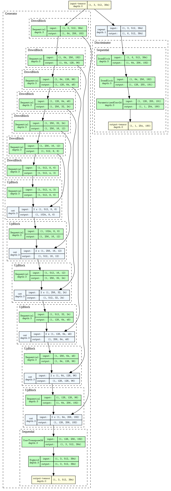

# Image Colorization with Neural Networks

> A deep learning application that colorizes grayscale images, deployed on Kubernetes with a full CI/CD pipeline.

---

| **Live Demo** |
| :---:|
| [**https://colorization.dyn.cloud.e-infra.cz/**](https://colorization.dyn.cloud.e-infra.cz/) |

## 📖 Table of Contents
- [Project Overview](#project-overview)
- [Key Features](#key-features)
- [Architecture](#architecture)
- [Tech Stack](#tech-stack)
- [The Machine Learning Model](#the-machine-learning-model)
- [Project Repositories](#project-repositories)

## 🌟 Project Overview
I wanted this project to be complete, end-to-end process which goes beyond just training a deep learning model. The goal is to bring the model to user-facing frontend in a scalable and devops-focused way. It takes a grayscale image from a user, uses a Conditional Generative Adversarial Network (cGAN) to add realistic color, and returns the result. The entire system is containerized and deployed on a public Kubernetes cluster using Helm, with automated builds and deployments managed by GitHub Actions.

## ✨ Key Features
- **ML-Powered Colorization:** Utilizes a Pix2Pix cGAN model trained on the COCO dataset.
- **RESTful API:** A simple and robust FastAPI backend provides the inference endpoint.
- **Interactive Frontend:** A SvelteKit frontend for interacting with the model.
- **Scalable Infrastructure:** Deployed on Kubernetes for high availability and scalability.
- **Automated CI/CD:** GitHub Actions pipeline automatically builds, and deploys changes to the cluster.

## 🏗️ Architecture
The system is designed as a set of decoupled microservices that communicate over HTTP and a message queue for robust, asynchronous processing.

1.  **User** uploads an image via the **SvelteKit Frontend**.
2.  The **Frontend** sends the image to the **FastAPI Backend** API endpoint.
3.  The **Backend** does the inference using the provided grayscale image.
4. The resulting **colorized** image is sent back to the frontend.

### conditional GAN Architecture

## 🛠️ Tech Stack

| Category | Technology |
| :--- | :--- |
| **Frontend** | SvelteKit, TypeScript, TailwindCSS |
| **Backend** | Python, FastAPI, Pydantic |
| **ML/Data Science** | PyTorch, NumPy, Pillow|
| **Infrastructure** | Docker, Kubernetes, Helm, NGINX Ingress |
| **CI/CD** | GitHub Actions |

## 🧠 The Machine Learning Model
The colorization model is a Conditional GAN based on the Pix2Pix architecture.

- **Generator:** U-Net architecture with skip connections tasked with generating detailed images.
- **Discriminator:** PatchGAN classifier that determines if `(input, output)` pairs are real or fake.
- **Dataset:** Trained on a 10,000-image subset of the COCO dataset.
- **[https://github.com/vojtam/cGAN-image-colorization](#ML-project-repository)**

## 📂 Project Repositories
This project is split into four repositories, each with a specific responsibility:

| Repository | Description | Link |
| :--- | :--- | :---: |
| 🎨 **Frontend** | SvelteKit user interface. | [image-colorizer-frontend](https://github.com/vojtam/colorization-frontend) |
| 🚀 **Backend** | FastAPI application handling API requests. | **(This Repository)** |
| 🧠 **Model Training**| Scripts, notebooks, and code for training the cGAN model. | [image-colorizer-training](https://github.com/vojtam/cGAN-image-colorization) |
| ⚙️ **Infrastructure**| Kubernetes manifests, Helm charts, and CI/CD workflows. | [image-colorizer-infra](https://github.com/vojtam/colorization-helm-manifests) |

